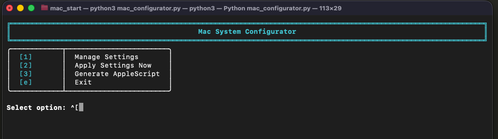

# Mac System Configurator

Interactive Python utility to manage and apply Mac system settings with a beautiful Rich-powered terminal UI.

## Features

- **Manage Settings**: Browse settings by category with visual status indicators
- **Apply Settings**: Apply configured settings to your Mac (with admin permission handling)
- **Generate AppleScript**: Create a script for startup or ad-hoc execution
- **Rich Terminal UI**: Beautiful tables, panels, and color-coded status displays
- **Admin Awareness**: Non-admin users can view/edit all settings; admin-required settings are clearly marked and skipped during apply

## Available Settings

### Network
- **WiFi Enabled** (boolean) - 🔒 Requires admin privileges

### Audio
- **Input Muted** (boolean) - Mute/unmute system microphone
- **Output Volume** (0-100) - Set system speaker volume

### Dock
- **Auto-hide Dock** (boolean) - Automatically hide/show the Dock
- **Dock Position** (choice: left/bottom/right) - Set Dock screen position

### Finder
- **Show Hidden Files** (boolean) - Show/hide hidden files in Finder
- **Show All Extensions** (boolean) - Show/hide file extensions

### System
- **Screenshot Location** (string) - Directory path for saving screenshots

## Screenshots

The configurator features a beautiful, color-coded Rich terminal interface:

### Main Menu


The main menu provides quick access to all functionality with a clean, numbered interface.

### Manage Settings - Category Selection


Categories are color-coded with icons for easy identification:
- 🌐 **Network** (blue)
- 🔊 **Audio** (magenta)
- 📱 **Dock** (cyan)
- 📁 **Finder** (green)
- ⚙️ **System** (yellow)

### Finder Settings View


Settings are displayed in a clear table showing:
- **Yellow** = Configured values
- **Magenta** = Current system values
- **Green ✓** = Matched (settings in sync)
- **Yellow ⚠** = Mismatched (needs attention)
- **Red 🔒** = Requires admin privileges

### AppleScript Generation


Generate an AppleScript file that can be run at startup or on-demand to automatically apply all configured settings.

## Installation

1. Install dependencies:
```bash
pip3 install rich
```

2. Run the configurator:
```bash
python3 mac_configurator.py
```

## Usage

### Interactive Mode

```bash
python3 mac_configurator.py
```

The interactive menu provides:
1. **Manage Settings** - Browse by category, view/edit individual settings
2. **Apply Settings Now** - Apply all configured settings to your system
3. **Generate AppleScript** - Create a startup/ad-hoc script
4. **Exit**

### Workflow

**Editing Settings:**
1. Select "Manage Settings"
2. Choose a category (Network, Audio, Dock, etc.)
3. Select a setting to edit
4. Enter new value
5. Optionally apply immediately (type 'y') or press Enter to skip

**Applying Settings:**
- From main menu, select "Apply Settings Now"
- All settings that differ from system state will be applied
- Settings requiring admin privileges are automatically skipped for non-admin users

### Admin Permission Handling

**Non-admin users:**
- Can view and edit ALL settings
- Settings are saved to config regardless of admin status
- Admin-required settings show 🔒 icon
- Yellow warning panel displays when viewing categories with admin settings
- Admin-required settings are skipped during "Apply Settings Now"

**Admin users:**
- Can apply all settings without restrictions

### Command-line Mode

Apply settings without interaction (used by generated AppleScript):

```bash
python3 mac_configurator.py --apply
```

### Generated AppleScript

Use option 3 in the interactive menu to generate `apply_settings.scpt`.

**Run manually:**
```bash
osascript apply_settings.scpt
```

**Add to Login Items:**
1. Open System Settings > General > Login Items
2. Click '+' under 'Open at Login'
3. Select the generated `apply_settings.scpt` file

## Configuration

Settings are stored in `config.json`:

```json
{
  "settings": {
    "wifi_enabled": true,
    "audio_input_muted": false,
    "audio_output_volume": 50,
    "dock_autohide": false,
    "dock_position": "bottom",
    "finder_show_hidden": false,
    "finder_show_extensions": true,
    "screenshot_location": "~/Desktop"
  }
}
```

## Requirements

- macOS
- Python 3.x
- [Rich](https://github.com/Textualize/rich) library (`pip3 install rich`)
- Administrator privileges (only for certain settings like WiFi control)

## Adding New Settings

The configurator is designed to be easily extensible:

1. **Create a handler class** with `get_` and `set_` methods
2. **Add to categories dictionary** in `MacConfigurator.__init__()`:
   ```python
   'category_name': {
       'setting_key': {
           'name': 'Display Name',
           'type': 'boolean',  # or 'integer', 'choice', 'string'
           'get_current': handler.get_method,
           'set_value': handler.set_method,
           'requires_admin': False  # or True
       }
   }
   ```
3. **Add default value** to `config.json`

## Setting Types

- **boolean**: Yes/No confirmation prompts
- **integer**: Numeric input with min/max validation
- **choice**: Multiple choice selection from predefined options
- **string**: Free text input (useful for paths, names, etc.)

## Notes

- Settings marked with 🔒 require admin privileges to apply
- Dock and Finder settings automatically restart their respective applications
- Screenshot location changes take effect immediately
- WiFi changes may require admin authentication
