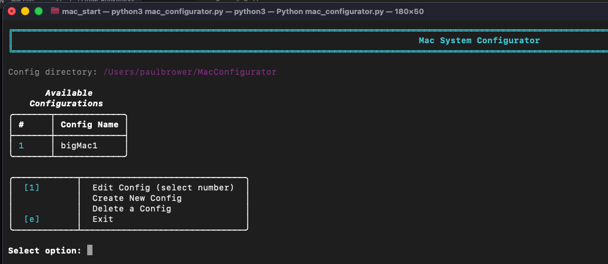
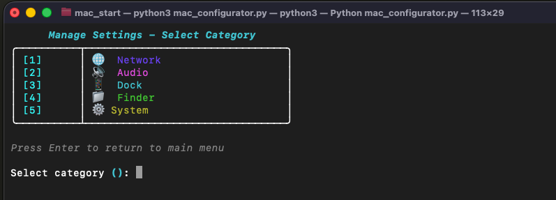
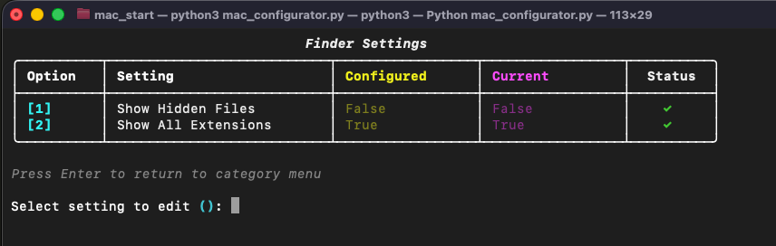
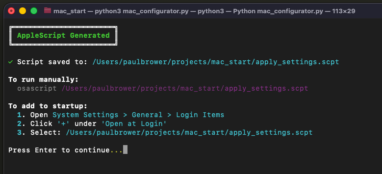

# Mac System Configurator

Interactive Python utility to manage and apply Mac system settings with a beautiful Rich-powered terminal UI and JSON Schema validation.

## Features

- **Multiple Configurations**: Create and manage different configuration profiles (Work, Home, Presentation, etc.)
- **Schema-Based Settings**: All settings defined with JSON Schema validation
- **Explicit Configuration**: Only apply settings you've explicitly configured
- **Live System Values**: Always see your configured value vs. actual system state
- **Delete/Unset Settings**: Remove settings to return to system defaults
- **Manage Settings**: Browse settings by category with visual status indicators
- **Apply Settings**: Apply configured settings to your Mac (with admin permission handling)
- **Generate AppleScript**: Create a script for startup or ad-hoc execution
- **Rich Terminal UI**: Beautiful tables, panels, and color-coded status displays
- **Admin Awareness**: Non-admin users can view/edit all settings; admin-required settings are clearly marked and skipped during apply

## Available Settings

### Network
- **WiFi Enabled** (boolean) - 🔒 Requires admin privileges

### Audio
- **Input Muted** (boolean) - Mute/unmute system microphone
- **Output Volume** (0-100) - Set system speaker volume

### Dock
- **Auto-hide Dock** (boolean) - Automatically hide/show the Dock
- **Dock Position** (choice: left/bottom/right) - Set Dock screen position

### Finder
- **Show Hidden Files** (boolean) - Show/hide hidden files in Finder
- **Show All Extensions** (boolean) - Show/hide file extensions

### System
- **Screenshot Location** (string) - Directory path for saving screenshots

## Screenshots

The configurator features a beautiful, color-coded Rich terminal interface:

### Main Menu


The main menu provides quick access to all functionality with a clean, numbered interface.

### Manage Settings - Category Selection


Categories are color-coded with icons for easy identification:
- 🌐 **Network** (blue)
- 🔊 **Audio** (magenta)
- 📱 **Dock** (cyan)
- 📁 **Finder** (green)
- ⚙️ **System** (yellow)

### Finder Settings View


Settings are displayed in a clear table showing:
- **Your Config** (Yellow) = Your configured values
- **Live System** (Magenta) = Current actual system values
- **Green ✓** = Matched (settings in sync)
- **Yellow ⚠** = Mismatched (configured value differs from system)
- **Dim ○** = Not configured (using system defaults)
- **Red 🔒** = Requires admin privileges

### AppleScript Generation


Generate an AppleScript file that can be run at startup or on-demand to automatically apply all configured settings.

## Installation

1. Install dependencies:
```bash
pip3 install rich jsonschema
```

2. Run the configurator:
```bash
python3 mac_configurator.py
```

### Optional: Create a Command-Line Shortcut

For quick access, create an alias to launch the configurator from anywhere:

**For Zsh (macOS default):**
```bash
echo "alias cfg='python3 /Users/$(whoami)/projects/mac_start/mac_configurator.py'" >> ~/.zshrc
source ~/.zshrc
```

**For Bash:**
```bash
echo "alias cfg='python3 /Users/$(whoami)/projects/mac_start/mac_configurator.py'" >> ~/.bash_profile
source ~/.bash_profile
```

**Customize the path** if you cloned the project to a different location. Replace `/Users/$(whoami)/projects/mac_start/` with your actual path.

Once set up, you can launch the configurator from anywhere by simply typing:
```bash
cfg
```

## Usage

### Interactive Mode

```bash
python3 mac_configurator.py
```

On first run, you'll see the **Configuration Management** screen:

**If no configurations exist:**
- Create New Config
- Exit

**If configurations exist:**
- Select a configuration to edit (by number)
- Create New Config
- Delete a Config
- Exit

Once you select or create a configuration, you'll enter the **Settings Management** screen with:
1. **Manage Settings** - Browse by category, view/edit individual settings
2. **Apply Settings Now** - Apply all configured settings to your system
3. **Generate AppleScript** - Create a startup/ad-hoc script for this config
4. **Exit** (returns to Configuration Management)

### Workflow

**Viewing Settings:**
- When you select a setting, you'll see:
  - **Your Config**: The value you've configured (or "Not configured")
  - **Live System**: The actual current value on your Mac
  - Helpful indicators showing if values match or differ

**When Values Differ:**
- If your configured value differs from the live system value:
  - You'll be prompted: "Apply this setting now? (y/n) [n]:"
  - Press Enter to skip, or type 'y' to apply immediately
  - After applying, you'll see refreshed status

**Editing Settings:**
1. Select "Manage Settings"
2. Choose a category (Network, Audio, Dock, etc.)
3. Select a setting to view/edit
4. If configured value differs from system, optionally apply it
5. You can delete configured settings to "unset" them
6. Enter new value if desired
7. Optionally apply immediately or press Enter to skip

**Applying Settings:**
- From main menu, select "Apply Settings Now"
- Only explicitly configured settings that differ from system state will be applied
- Settings requiring admin privileges are automatically skipped for non-admin users

### Admin Permission Handling

**Non-admin users:**
- Can view and edit ALL settings
- Settings are saved to config regardless of admin status
- Admin-required settings show 🔒 icon
- Yellow warning panel displays when viewing categories with admin settings
- Admin-required settings are skipped during "Apply Settings Now"

**Admin users:**
- Can apply all settings without restrictions

### Multiple Configurations

Create different configuration profiles for different scenarios:

**Example Use Cases:**
- **Work**: WiFi on, volume at 50%, Dock on bottom
- **Home**: WiFi on, volume at 75%, Dock auto-hide enabled
- **Presentation**: WiFi off, volume at 100%, Dock hidden, show all extensions

**Creating a New Config:**
1. Launch the configurator
2. Select "Create New Config" (or press 'c')
3. Enter a name (letters, numbers, spaces, hyphens, underscores allowed)
4. Configure your settings
5. The config is automatically saved

**Switching Between Configs:**
- Exit to the main menu (press 'e')
- Select a different configuration by number
- Your settings are automatically loaded

**Deleting a Config:**
1. From the main menu, press 'd'
2. Select the config number to delete
3. Confirm deletion

### Command-line Mode

Apply settings for a specific configuration without interaction (used by generated AppleScript):

```bash
# Apply specific config
python3 mac_configurator.py --apply "Work"

# Apply first available config (if config name not specified)
python3 mac_configurator.py --apply
```

### Generated AppleScript

Use option 3 in the interactive menu to generate a config-specific AppleScript (e.g., `apply_Work_settings.scpt`).

**Script Location:**
AppleScripts are saved in the config directory alongside your configuration files:
- Default: `~/MacConfigurator/apply_[ConfigName]_settings.scpt`

**Run manually:**
```bash
osascript ~/MacConfigurator/apply_Work_settings.scpt
```

**Add to Login Items:**
1. Open System Settings > General > Login Items
2. Click '+' under 'Open at Login'
3. Navigate to `~/MacConfigurator/`
4. Select the generated script (e.g., `apply_Work_settings.scpt`)

Each configuration can have its own AppleScript for different startup scenarios. All files stay organized in one directory.

## Configuration

### Architecture

The configurator uses a **schema-first architecture** with multiple configuration files:

**`.userConfig`** - Stores the configuration directory path
- Created automatically on first run
- Default location: `~/MacConfigurator`
- Contains JSON: `{"config_directory": "/path/to/configs"}`
- Excluded from git (in .gitignore)

**`settings_schema.json`** - Defines all available settings
- JSON Schema definitions with validation rules
- Type constraints (boolean, integer with min/max, enum, string)
- Metadata (title, description, category, handler, admin requirements)
- This file defines what CAN be configured

**`[config_name]_config.json`** - Individual configuration files
- Stored in the directory specified by `.userConfig`
- Each config file contains ONLY explicitly configured settings
- Settings not in a config file use system defaults
- Can be empty or partial - perfectly valid!
- File naming: `Work_config.json`, `Home_config.json`, etc.

### File Locations

```
Project Directory:
├── .userConfig                          # Config directory path
├── settings_schema.json                 # Settings definitions
└── mac_configurator.py                  # Main application

~/MacConfigurator/ (default config directory):
├── Work_config.json                     # Work configuration
├── Home_config.json                     # Home configuration
├── Presentation_config.json             # Presentation configuration
├── apply_Work_settings.scpt             # Generated AppleScript for Work
├── apply_Home_settings.scpt             # Generated AppleScript for Home
└── apply_Presentation_settings.scpt     # Generated AppleScript for Presentation
```

### Example Configuration File

**`Work_config.json`:**
```json
{
  "settings": {
    "audio_output_volume": 50,
    "dock_position": "bottom",
    "wifi_enabled": true
  }
}
```

**`Presentation_config.json`:**
```json
{
  "settings": {
    "audio_output_volume": 100,
    "dock_autohide": true,
    "wifi_enabled": false
  }
}
```

Note: Only configured settings appear in each file. All other settings use system defaults and won't be applied.

### Validation

**Settings Validation:**
All settings are validated against `settings_schema.json`:
- Type checking (boolean, integer, string, enum)
- Range validation (e.g., volume 0-100)
- Enum validation (e.g., dock position must be left/bottom/right)
- Invalid values are rejected with clear error messages

**Config Name Validation:**
Configuration names must:
- Contain only letters, numbers, spaces, hyphens, and underscores
- Not be empty
- Be unique (no duplicate config names)

## Requirements

- macOS
- Python 3.7+
- [Rich](https://github.com/Textualize/rich) library (`pip3 install rich`)
- [jsonschema](https://pypi.org/project/jsonschema/) library (`pip3 install jsonschema`)
- Administrator privileges (only for certain settings like WiFi control)

## Adding New Settings

The configurator uses a **schema-first approach** for easy extensibility:

### Step 1: Update `settings_schema.json`

Add your setting definition with JSON Schema validation:

```json
{
  "properties": {
    "settings": {
      "properties": {
        "your_setting_key": {
          "type": "boolean",
          "title": "Your Setting Name",
          "description": "What this setting does",
          "category": "CategoryName",
          "handler": "YourHandler",
          "requires_admin": false
        }
      }
    }
  }
}
```

For integers, add `minimum` and `maximum`:
```json
{
  "type": "integer",
  "minimum": 0,
  "maximum": 100
}
```

For choices/enums:
```json
{
  "type": "string",
  "enum": ["option1", "option2", "option3"]
}
```

### Step 2: Create Handler Class

Create a handler with `get` and `set` methods:

```python
class YourHandler:
    @staticmethod
    def get_your_setting():
        """Get current system state - returns None on failure"""
        try:
            # Query system using subprocess, defaults, etc.
            return value
        except:
            return None

    @staticmethod
    def set_your_setting(value):
        """Set system value - returns True/False"""
        try:
            # Apply to system
            return True
        except:
            return False
```

### Step 3: Register Handler

In `MacConfigurator.__init__()`:

1. Instantiate your handler:
```python
self.your_handler = YourHandler()
```

2. Add to handler map:
```python
self.handler_map = {
    'YourHandler': self.your_handler,
    # ... other handlers
}
```

3. Add to handler methods:
```python
self.handler_methods = {
    'your_setting_key': ('get_your_setting', 'set_your_setting'),
    # ... other methods
}
```

That's it! The setting will automatically appear in the UI with validation.

**Note:** You do NOT need to add defaults to `config.json`. Settings only appear there when users explicitly configure them.

## Setting Types

- **boolean**: Yes/No confirmation prompts
- **integer**: Numeric input with min/max validation
- **choice**: Multiple choice selection from predefined options
- **string**: Free text input (useful for paths, names, etc.)

## Development

### Claude Code Integration

This project includes `.clinerules` - a project-specific instructions file for Claude Code that ensures:
- README is updated after user-facing changes
- Schema-first development is followed when adding settings
- Proper testing and validation before completing tasks
- Consistent code style and variable naming

If you're using Claude Code, these rules will be automatically applied.

## Notes

- **Multiple configs**: Each configuration is completely independent
- **Config directory**: Stored in `~/MacConfigurator` by default (customizable via `.userConfig`)
- Settings marked with 🔒 require admin privileges to apply
- Dock and Finder settings automatically restart their respective applications
- Screenshot location changes take effect immediately
- WiFi changes may require admin authentication
- Settings only apply if you've explicitly configured them in that specific config
- You can delete/unset settings to return to system defaults
- Each configuration can have its own AppleScript for automatic application
